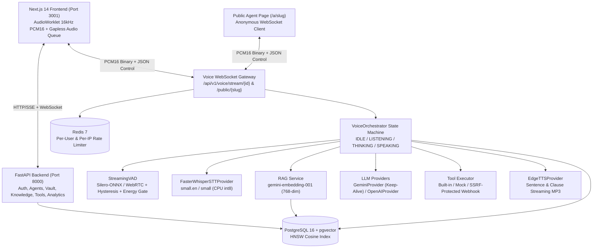
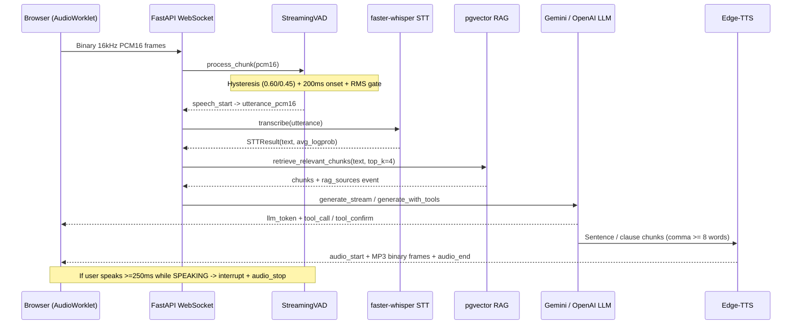
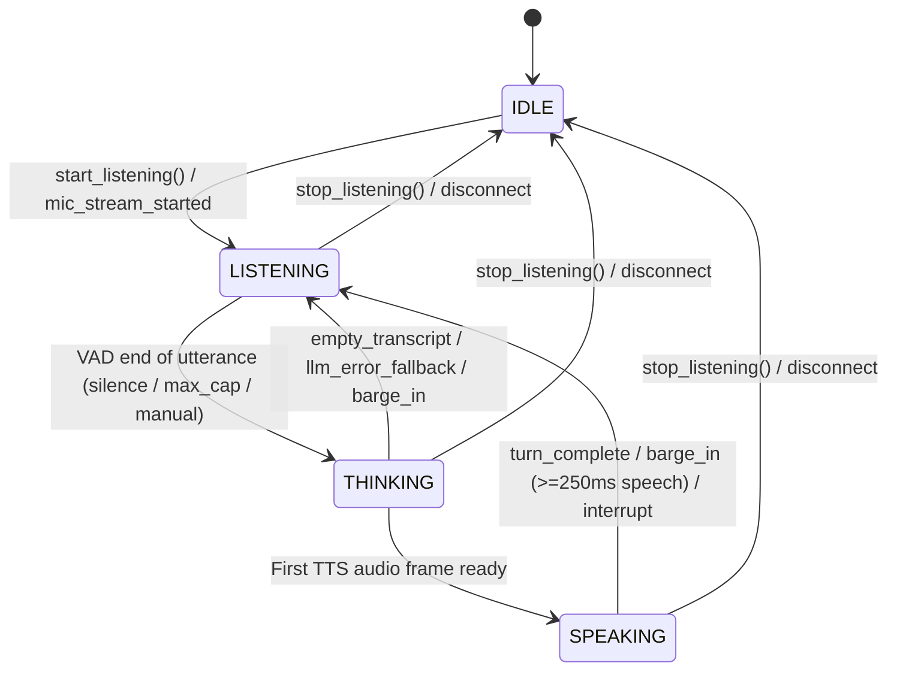
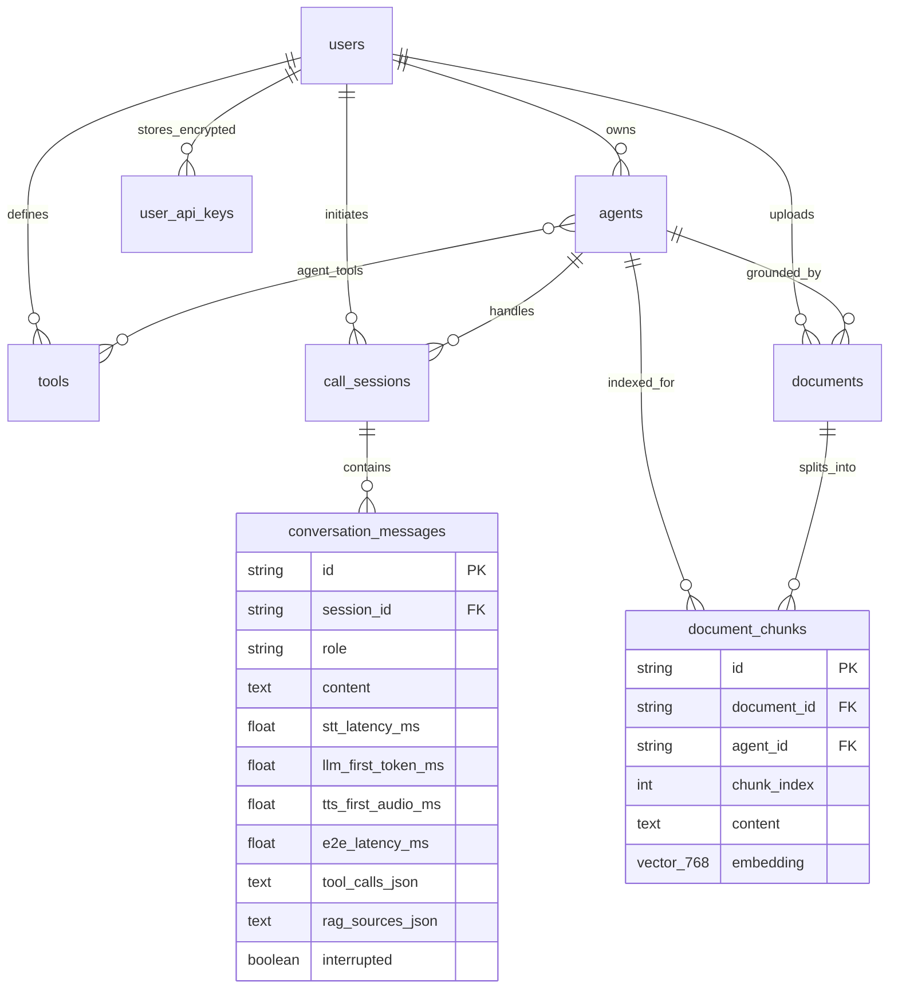

# System Architecture

## 1. High-Level System Architecture

```mermaid
flowchart TD
    Browser["Next.js 14 Frontend (Port 3001)<br/>AudioWorklet 16kHz PCM16 + Gapless Audio Queue"]
    Public["Public Agent Page (/a/slug)<br/>Anonymous WebSocket Client"]
    API["FastAPI Backend (Port 8000)<br/>Auth, Agents, Vault, Knowledge, Tools, Analytics"]
    WS["Voice WebSocket Gateway<br/>/api/v1/voice/stream/{id} & /public/{slug}"]
    Orch["VoiceOrchestrator State Machine<br/>IDLE / LISTENING / THINKING / SPEAKING"]
    VAD["StreamingVAD<br/>Silero-ONNX / WebRTC + Hysteresis + Energy Gate"]
    STT["FasterWhisperSTTProvider<br/>small.en / small (CPU int8)"]
    RAG["RAG Service<br/>gemini-embedding-001 (768-dim)"]
    LLM["LLM Providers<br/>GeminiProvider (Keep-Alive) / OpenAIProvider"]
    Tools["Tool Executor<br/>Built-in / Mock / SSRF-Protected Webhook"]
    TTS["EdgeTTSProvider<br/>Sentence & Clause Streaming MP3"]
    PG[("PostgreSQL 16 + pgvector<br/>HNSW Cosine Index")]
    Redis[("Redis 7<br/>Per-User & Per-IP Rate Limiter")]

    Browser <-->|"HTTP/SSE + WebSocket"| API
    Browser <-->|"PCM16 Binary + JSON Control"| WS
    Public <-->|"PCM16 Binary + JSON Control"| WS
    WS --> Orch
    Orch --> VAD
    Orch --> STT
    Orch --> RAG
    Orch --> LLM
    Orch --> Tools
    Orch --> TTS
    API --> PG
    RAG --> PG
    Orch --> PG
    WS --> Redis
```

## 2. Real-Time Voice Pipeline Sequence

```mermaid
sequenceDiagram
    participant U as Browser (AudioWorklet)
    participant W as FastAPI WebSocket
    participant V as StreamingVAD
    participant S as faster-whisper STT
    participant R as pgvector RAG
    participant L as Gemini / OpenAI LLM
    participant T as Edge-TTS

    U->>W: Binary 16kHz PCM16 frames
    W->>V: process_chunk(pcm16)
    Note over V: Hysteresis (0.60/0.45) + 200ms onset + RMS gate
    V-->>W: speech_start -> utterance_pcm16
    W->>S: transcribe(utterance)
    S-->>W: STTResult(text, avg_logprob)
    W->>R: retrieve_relevant_chunks(text, top_k=4)
    R-->>W: chunks + rag_sources event
    W->>L: generate_stream / generate_with_tools
    L-->>U: llm_token + tool_call / tool_confirm
    L->>T: Sentence / clause chunks (comma >= 8 words)
    T-->>U: audio_start + MP3 binary frames + audio_end
    Note over U,V: If user speaks >=250ms while SPEAKING -> interrupt + audio_stop
```

## 3. VoiceOrchestrator State Machine

```mermaid
stateDiagram-v2
    [*] --> IDLE
    IDLE --> LISTENING: start_listening() / mic_stream_started
    LISTENING --> THINKING: VAD end of utterance (silence / max_cap / manual)
    THINKING --> SPEAKING: First TTS audio frame ready
    THINKING --> LISTENING: empty_transcript / llm_error_fallback / barge_in
    SPEAKING --> LISTENING: turn_complete / barge_in (>=250ms speech) / interrupt
    LISTENING --> IDLE: stop_listening() / disconnect
    THINKING --> IDLE: stop_listening() / disconnect
    SPEAKING --> IDLE: stop_listening() / disconnect
```

## 4. Database Entity-Relationship Diagram

```mermaid
erDiagram
    users ||--o{ agents : owns
    users ||--o{ user_api_keys : stores_encrypted
    users ||--o{ tools : defines
    users ||--o{ documents : uploads
    users ||--o{ call_sessions : initiates
    agents ||--o{ call_sessions : handles
    agents ||--o{ documents : grounded_by
    agents ||--o{ document_chunks : indexed_for
    agents }o--o{ tools : agent_tools
    documents ||--o{ document_chunks : splits_into
    call_sessions ||--o{ conversation_messages : contains

    document_chunks {
        string id PK
        string document_id FK
        string agent_id FK
        int chunk_index
        text content
        vector_768 embedding
    }
    conversation_messages {
        string id PK
        string session_id FK
        string role
        text content
        float stt_latency_ms
        float llm_first_token_ms
        float tts_first_audio_ms
        float e2e_latency_ms
        text tool_calls_json
        text rag_sources_json
        boolean interrupted
    }
```
